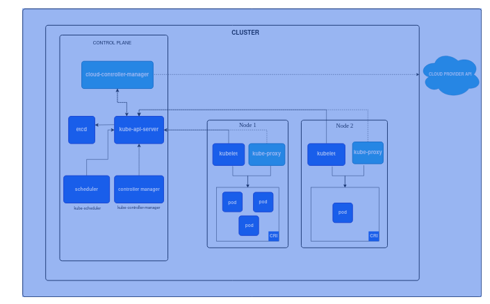

# Kubernetes aka K8s

Its a open source container orchestration tool
Helps manage containerized applications in different deployment environments.

Use cases:
Used along with containers(Ex: Docker containers)
proper way of managing hundreds or thousands of containers across different deployment platforms like local, VMs, and cloud.

Features:

1. High availability(no downtime)
2. Scalability
3. Disaster recovery - backup/restore

# Architecture:



## Master node:

> 1 or more Master node(AKA Control plane nodes)

> Master node runs several processes necessary to run Kubernetes cluster. This includes:

1. **API server** - allows clients to communicate with kubernetes cluster - Entrypoint to K8s Cluster - Ex: clients that use API server are Kubenetes UI, other APIs, and kubernetes CLI.
2. **Controller manager** - Keeps track of whats happening in the cluster.
3. **Scheduler** - decides on which node new pod should be scheduled depending on the server resources(like CPU, RAM etc) available.
4. **etcd** - Key value store which holds current state of the kubernetes cluster.

## Worker node:

> 1 or many Worker nodes(EC2/VMs/Local servers) where your applications will be running.
> Each worker node will contain **kublet**(say docker daemon like service for kubernetes)
> Each worker node has containers running inside wrappers called **pods**.

## Virtual network:

- Combines all the nodes inside a cluster in to one powerful machine by combine all the resources available from workernodes in the cluster.

# Main kubernetes Components

1. Pod
2. Service
3. Ingress
4. ConfigMap
5. Secret
6. Volumes
7. Deployment
8. StatefulSet
9. DaemonSet

## Pod:

Smallest unit in kubernetes
Abstraction over container
Pod makes possible to use different container technologies like docker, podman etc in a consistent way.
Multiple containers can be run per pod.
Best practise is one application(not container) per pod.
Each pod has one IP address which is used to communicate with other pods. Will get new IP address at every restart.
Pods are ephimeral - means state is only managed in pod lifecycle means pods may stop running and will be replaces with another pod.

```
apiVersion: v1
kind: Pod
metadata:
  name: my-pod
spec:
  containers:
    - name: my-container
      image: nginx
```

## Service:

Static/Permanent IP address attached to each pod.
Lifecycle of service and pods are not connected. Pod may die but service will be running.
Depending on wheteher a pod should be made available to be accessed from outside or no outside access allowed, we use **external** and **internal** service. This is very similar to public/private subnet concept.
```
apiVersion: v1
kind: Service
metadata:
  name: backend-service
spec:
  type: NodePort
  selector:
    app: backend
  ports:
    - port: 8000
      targetPort: 8000
      nodePort: 30001
```

## Ingress:

Instead of using IP address of services, ingress maps a domain to the IPs and forwards incoming requests to the destination service. Acts like router for services IPs
```
apiVersion: networking.k8s.io/v1
kind: Ingress
metadata:
  name: frontend-ingress
spec:
  rules:
    - host: todo-app.local
      http:
        paths:
          - path: /
            pathType: Prefix
            backend:
              service:
                name: frontend-service
                port:
                  number: 8080
```

## ConfigMap:

External configuration of your application.
may contain urls and domains of each service that your application needs to communicate with.
Ex: database url, username etc.
```
apiVersion: v1
kind: ConfigMap
metadata:
  name: app-config
data:
  MONGO_URL: "mongodb://mongo:27017"

```

## Secret:

Allows you to store secrets in base64 encoded format. They may be encrypted using third party tools for better security.
Ex: passwords, certificates etc.

```
apiVersion: v1
kind: Secret
metadata:
  name: mongo-secret
type: Opaque
data:
  password: bW9uZ29wYXNzCg==  # base64 encoded
```

## Volumes:

Similar to docker volumes to persist data during container lifecycle.
Can be local, remote and cloud storage.
```
apiVersion: v1
kind: PersistentVolumeClaim
metadata:
  name: mongo-pvc
spec:
  accessModes:
    - ReadWriteOnce
  resources:
    requests:
      storage: 1Gi

```

## Deployment(replication mechanism):

A Deployment manages a set of Pods to run an application workload, usually one that doesn't maintain state.
Whenever we update images, we may need to propagate to containers running on pods. Using replica we can deploy same set of containers/applications accross clusters. Using blueprint we can define the blue prints of the pods and deploy any number of replicas using deployments.
Deployments can be abstraction of pods.
Ex: you already running your application in three containers running accross two pods. Now you have made changes to the application and built new docker images. If you just run one replica of the application then when you change the image, there will be downtime. Instead of that, you can increase the replica, and deploy new images while the old version of your application is still running. then once the new version is deployed, you can remove the pods running old application version.
used to manage stateless applications like frontend, and backend
```
apiVersion: apps/v1
kind: Deployment
metadata:
  name: backend-deployment
spec:
  replicas: 2
  selector:
    matchLabels:
      app: backend
  template:
    metadata:
      labels:
        app: backend
    spec:
      containers:
        - name: backend
          image: my-backend:latest
          ports:
            - containerPort: 8000
```

## Statefulset(replication mechanism):

A StatefulSet runs a group of Pods, and maintains a sticky identity for each of those Pods. This is useful for managing applications that need persistent storage or a stable, unique network identity.
used to manage stateful applications like databases.

## DaemonSet
A DaemonSet defines Pods that provide node-local facilities. These might be fundamental to the operation of your cluster, such as a networking helper tool, or be part of an add-on.
A DaemonSet ensures that all (or some) Nodes run a copy of a Pod. As nodes are added to the cluster, Pods are added to them. As nodes are removed from the cluster, those Pods are garbage collected. Deleting a DaemonSet will clean up the Pods it created.

Some typical uses of a DaemonSet are:

    running a cluster storage daemon on every node
    running a logs collection daemon on every node
    running a node monitoring daemon on every node

# Configuring Kubernetes:

All Configurations are done through API server running on master node in control plane.
Kubernetes config files are YAML based.
Each config file contains three parts:
1. Metadata
2. Specification
3. Status => This is generated by Kubernetes to keep track of current status of the cluster from the etcd key value store
   
Ex: config file:
----------------------

```
apiVersion: apps/v1
kind: Deployment
metadata:
  name: webapp-deployment
  labels:
    app: webapp
spec:
  replicas: 1
  selector:
    matchLabels:
      app: webapp
  template:
    metadata:
      labels:
        app: webapp
    spec:
      containers:
      - name: webapp
        image: khanation/k8s-demo-app:v1.0
        ports:
        - containerPort: 3000
        env:
        - name: USER_NAME
          valueFrom:
            secretKeyRef:
              name: mongo-secret
              key: mongo-user
        - name: USER_PWD
          valueFrom:
            secretKeyRef:
              name: mongo-secret
              key: mongo-password 
        - name: DB_URL
          valueFrom:
            configMapKeyRef:
              name: mongo-config
              key: mongo-url
---
apiVersion: v1
kind: Service
metadata:
  name: webapp-service
spec:
  type: NodePort
  selector:
    app: webapp
  ports:
    - protocol: TCP
      port: 3000
      targetPort: 3000
      nodePort: 30100
```


```
apiVersion: v1
kind: ConfigMap
metadata:
  name: mongo-config
data:
  mongo-url: mongo-service
```

```
apiVersion: v1
kind: Secret
metadata:
  name: mongo-secret
type: Opaque
data:
  mongo-user: bW9uZ291c2Vy
  mongo-password: bW9uZ29wYXNzd29yZA==
```

```
apiVersion: apps/v1
kind: Deployment
metadata:
  name: mongo-deployment
  labels:
    app: mongo
spec:
  replicas: 1
  selector:
    matchLabels:
      app: mongo
  template:
    metadata:
      labels:
        app: mongo
    spec:
      containers:
      - name: mongodb
        image: mongo:5.0
        ports:
        - containerPort: 27017
        env:
        - name: MONGO_INITDB_ROOT_USERNAME
          valueFrom:
            secretKeyRef:
              name: mongo-secret
              key: mongo-user
        - name: MONGO_INITDB_ROOT_PASSWORD
          valueFrom:
            secretKeyRef:
              name: mongo-secret
              key: mongo-password  
---
apiVersion: v1
kind: Service
metadata:
  name: mongo-service
spec:
  selector:
    app: mongo
  ports:
    - protocol: TCP
      port: 27017
      targetPort: 27017
```